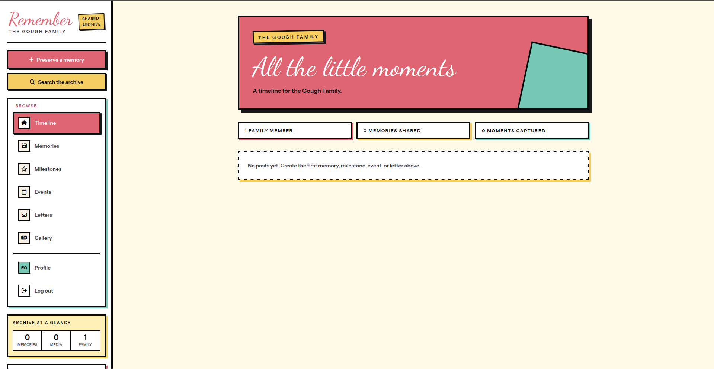
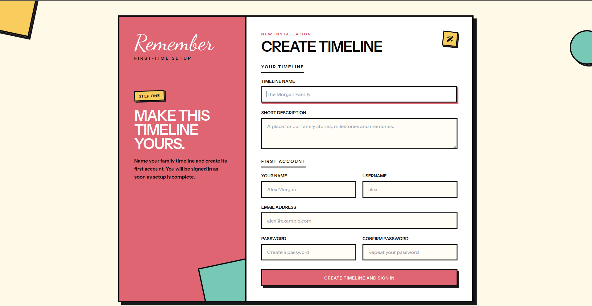
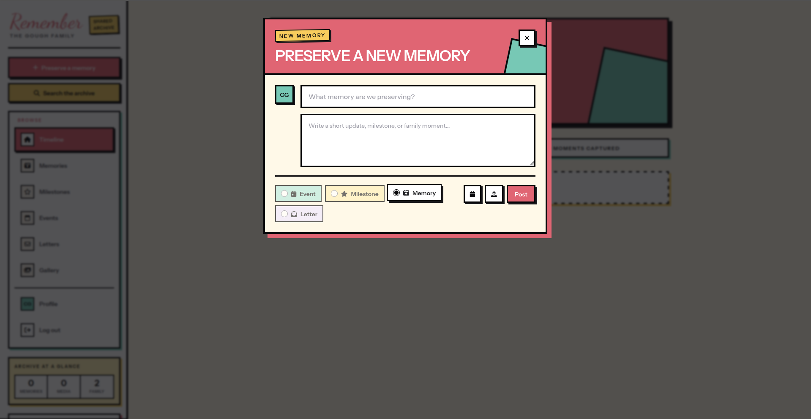
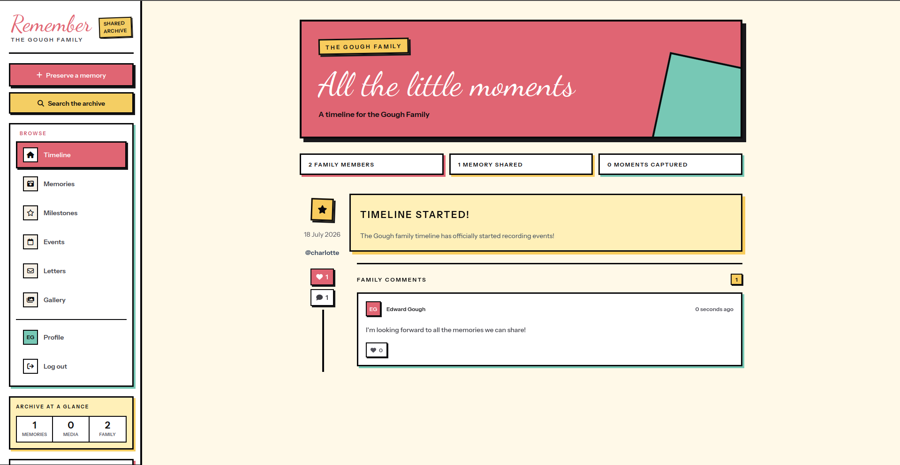
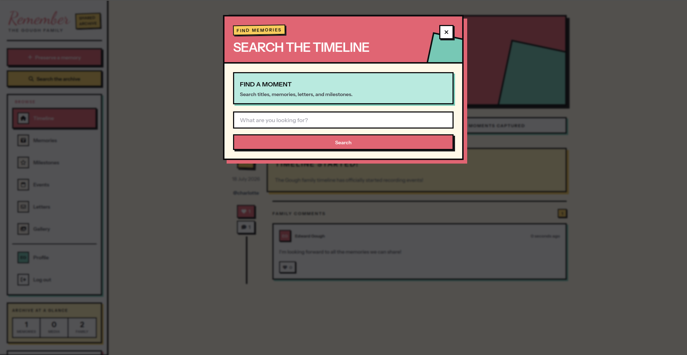
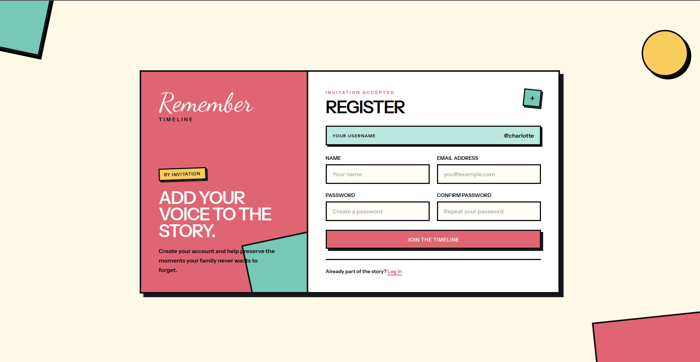

# Remember

<p align="center">
  <a href="https://github.com/realedwardgough/remember/actions/workflows/tests.yml"></a>
  <a href="https://github.com/realedwardgough/remember/actions/workflows/lint.yml"></a>
  <a href="https://github.com/realedwardgough/remember/actions/workflows/checkpoint.yml"></a>
  <a href="https://github.com/realedwardgough/remember/blob/master/LICENSE"></a>
</p>

<p align="center">
  <strong>A private, self-hosted family timeline for preserving the moments that matter.</strong>
</p>

<p align="center">
  Remember brings memories, milestones, events, photographs and private letters together in one shared family archive. It is built for small, invitation-only groups and wrapped in a colourful neo-brutalist interface that works across desktop and mobile.
</p>

<p align="center">
  
</p>

## Why Use Remember?

Remember was created to help families preserve the moments that matter most. Rather than disappearing into camera rolls or social media feeds, memories can be organised into a private timeline complete with photos, milestones and letters for future generations.

## What Remember offers

- A chronological family timeline with memories, milestones, events and private letters
- Image and file attachments with automatic WebP image optimisation
- Comments and hearts on shared posts
- Author-only private letters
- Search and filtering by post type, family member and hashtag
- A gallery with full-size image previews and downloads
- Invitation-only account registration
- Seeded `admin` and `user` roles powered by Spatie Laravel Permission
- An admin management area for timeline details, invitations, roles and members
- Reusable pending invitation URLs stored encrypted at rest
- A one-time browser setup flow for naming the timeline and creating its first account
- Responsive desktop and mobile navigation
- Installable web-app metadata and safe-area-aware mobile styling

## A look around

<table>
  <tr>
    <td width="50%">
      
      <br><strong>First-time setup</strong><br>
      Name the timeline and create the first account from one guided screen.
    </td>
    <td width="50%">
      
      <br><strong>Preserve a memory</strong><br>
      Add stories, dates, hashtags and media without leaving the timeline.
    </td>
  </tr>
  <tr>
    <td width="50%">
      
      <br><strong>Share the moment</strong><br>
      Family members can respond to shared posts with comments and hearts.
    </td>
    <td width="50%">
      
      <br><strong>Find it again</strong><br>
      Search the archive and narrow it by type, tag or author.
    </td>
  </tr>
  <tr>
    <td colspan="2">
      
      <br><strong>Keep the timeline private</strong><br>
      New family members join through single-use invitation links created by an administrator or from the application console.
    </td>
  </tr>
</table>

## Technology

- PHP 8.4 and Laravel 13
- Laravel Fortify for authentication
- Spatie Laravel Permission for roles and future authorization rules
- Inertia.js 3 and Vue 3
- Tailwind CSS 4
- Laravel Wayfinder for typed frontend routes
- MySQL for application data
- Redis for tagged timeline caching
- Intervention Image for media optimisation
- Google Cloud Storage or a Laravel filesystem disk for uploaded media

## Requirements

Before installing Remember, make sure the host has:

- PHP 8.4
- Composer 2
- MySQL 8 or a compatible MySQL/MariaDB server
- Redis
- The PHP Redis extension (`phpredis`), unless the application is adapted to use another supported Redis client
- A PHP image extension supported by Intervention Image, such as GD or Imagick
- Node.js 22 LTS and npm
- A web server such as Nginx, Apache or Laravel's development server
- Writable `storage` and `bootstrap/cache` directories

> [!IMPORTANT]
> Remember uses Laravel cache tags for timeline caching and cache invalidation. The database, file and array cache drivers do **not** support cache tags. Redis must be running and `CACHE_STORE=redis` must remain configured, otherwise timeline requests and post updates will fail.

## Installation

### 1. Clone and install dependencies

```bash
git clone https://github.com/realedwardgough/remember.git remember
cd remember
composer install
npm install
```

### 2. Create the environment file

```bash
cp .env.example .env
php artisan key:generate
```

Set the application URL and database credentials in `.env`:

```dotenv
APP_NAME="Remember"
APP_URL=https://remember.test

DB_CONNECTION=mysql
DB_HOST=127.0.0.1
DB_PORT=3306
DB_DATABASE=remember
DB_USERNAME=remember
DB_PASSWORD=your-database-password
```

If the local site is served over plain HTTP, set the secure-cookie option to false during local development:

```dotenv
SESSION_SECURE_COOKIE=false
```

### 3. Configure Redis

Redis is required by the application, even when the database queue driver is used.

```dotenv
CACHE_STORE=redis
REDIS_CLIENT=phpredis
REDIS_HOST=127.0.0.1
REDIS_PASSWORD=null
REDIS_PORT=6379
REDIS_DB=0
REDIS_CACHE_DB=1
```

The hostnames in `.env.example` (`mysql` and `redis`) are suitable for a container network where those services use those names. For services running directly on the host, use `127.0.0.1` instead.

Once configured, this command provides a quick connection check:

```bash
php artisan cache:clear
```

### 4. Configure media storage

Remember stores uploaded files on the disk selected by `MEDIA_DISK`. Google Cloud Storage is the default production-oriented option.

For Google Cloud Storage:

```dotenv
FILESYSTEM_DISK=gcs
MEDIA_DISK=gcs
GOOGLE_CLOUD_PROJECT_ID=your-project-id
GOOGLE_CLOUD_STORAGE_BUCKET=your-private-bucket
GOOGLE_CLOUD_KEY_FILE=/absolute/path/to/service-account.json
```

Alternatively, a local installation can use Laravel's public disk:

```dotenv
FILESYSTEM_DISK=public
MEDIA_DISK=public
```

When using the public disk, create Laravel's conventional storage link:

```bash
php artisan storage:link
```

Verify that the selected media disk can write, read and delete files:

```bash
php artisan media:verify-storage
```

### 5. Create the database and frontend build

```bash
php artisan migrate --seed
npm run build
```

The default session and queue drivers use the database. Their required tables are included in the migrations.

### 6. Start the application

For local development, the Composer development command starts Laravel, the queue listener, log viewer and Vite together:

```bash
composer run dev
```

You can also run the processes separately:

```bash
php artisan serve
npm run dev
php artisan queue:work
```

### 7. Create the timeline

Open `/setup` in the browser—for example, `https://remember.test/setup`—and provide:

- The timeline name
- An optional short timeline description
- The first user's name, username and email address
- A secure password

The timeline and first account are created together, and the first user is signed in immediately. After setup succeeds, both setup endpoints return a 404 and cannot be used again. The first account receives the `admin` role; accounts created later through invitation links receive the `user` role.

## Managing the timeline

Administrators can open **Manage timeline** from the account page. The management area allows them to:

- Update the timeline name and description
- Create invitation links and copy them again while they remain pending
- Generate a replacement URL for invitations created before reusable links were introduced
- Promote members to administrator or return them to the standard user role
- Remove accounts while preserving their posts and comments as anonymous history

The application prevents administrators from removing their own account or removing or demoting the final administrator. Destructive actions use an in-application confirmation dialog before they are submitted.

Invitation tokens are stored encrypted at rest, while a one-way hash is used to validate registration requests. Generating a replacement invitation URL invalidates the previous link.

## Inviting family members

Registration is invitation-only. Administrators can create and manage invitations from the timeline management area. A single-use invitation URL can also be created from the command line with:

```bash
php artisan users:create family-member
```

The command prints a registration URL. `APP_URL` must be correct before generating links. Each invitation reserves its username and is invalidated after use.

### Assigning roles from the command line

Existing installations can assign their first administrator by username or email address:

```bash
php artisan users:role family-member admin
php artisan users:role family@example.com admin
```

The role defaults to `admin` when omitted. The same command can assign the standard role:

```bash
php artisan users:role family-member user
```

The final administrator cannot be demoted, including through the command.

The `RoleSeeder` is idempotent and creates the `admin` and `user` roles. Existing installations can run `php artisan db:seed --class=RoleSeeder --force` to add missing roles, then use `users:role` to select an administrator explicitly.

## Updating an existing installation

After pulling a newer version, install dependencies, run migrations and rebuild the frontend:

```bash
composer install --no-interaction --prefer-dist --optimize-autoloader
php artisan migrate --force
npm install
npm run build
php artisan optimize
```

Older installations without a row in the `timelines` table are initialized automatically when an administrator first opens timeline management. Older pending invitations cannot reveal their original one-way token; use **Generate replacement URL** beside the invitation to rotate it safely.

## Development checks

Run the backend test suite:

```bash
php artisan test --compact
```

The PHPUnit suite uses attribute-based tests and currently runs without skipped tests. CI also enforces an initial 50% application coverage floor.

Check and format the frontend:

```bash
npm run types:check
npm run lint:check
npm run format:check
```

Build production assets:

```bash
npm run build
```

Format PHP changes with Laravel Pint:

```bash
vendor/bin/pint --format agent
```

## Production notes

- Serve the application over HTTPS and keep `SESSION_SECURE_COOKIE=true`.
- Keep Redis supervised and persistent enough for the desired cache behaviour.
- Run a queue worker under a process supervisor when using an asynchronous queue connection.
- Set `APP_DEBUG=false` and configure production logging and mail delivery.
- Configure the web server document root as the project's `public` directory.
- Ensure uploaded family media is stored privately and backed up appropriately.
- Run `php artisan optimize` after deploying configuration and application changes.

## Privacy

Remember is intended for private family content. Authentication protects the timeline, account creation is invitation-only, and letters are visible only to their author. Deployment security, backups, access controls and storage privacy remain the responsibility of the person hosting the application.

## Contributing

Issues and pull requests are welcome. If you have an idea that would make Remember better, feel free to open a discussion.

## License

Remember is open-source software released under the MIT license.
